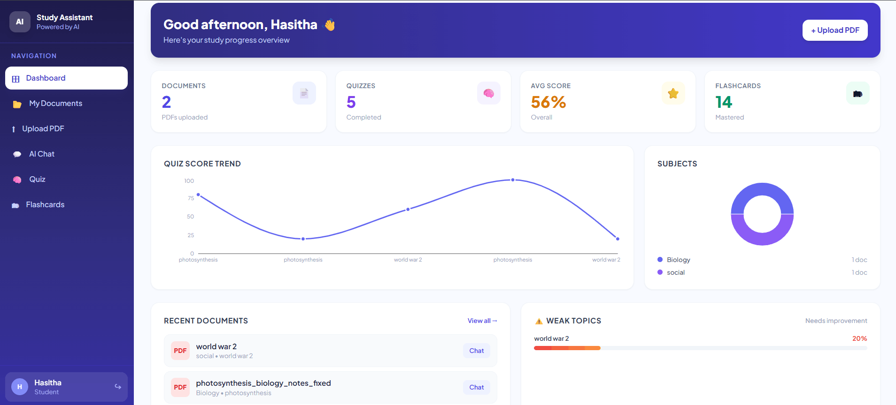
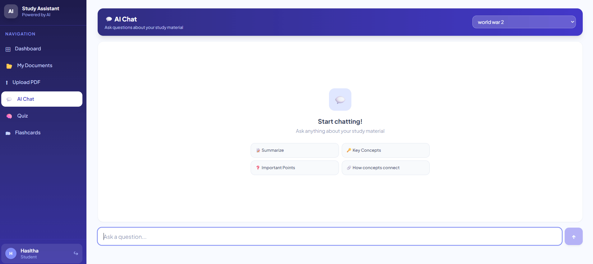
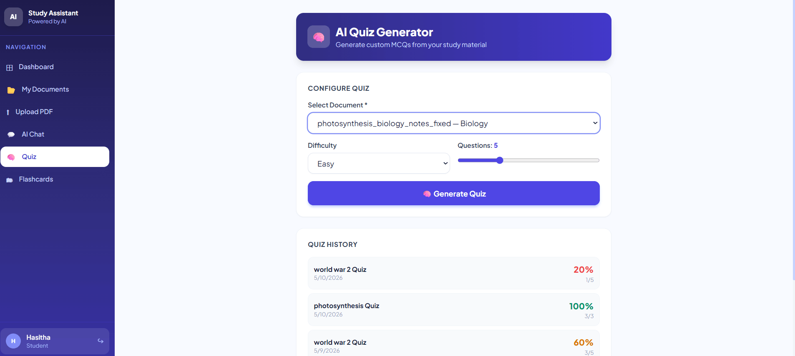
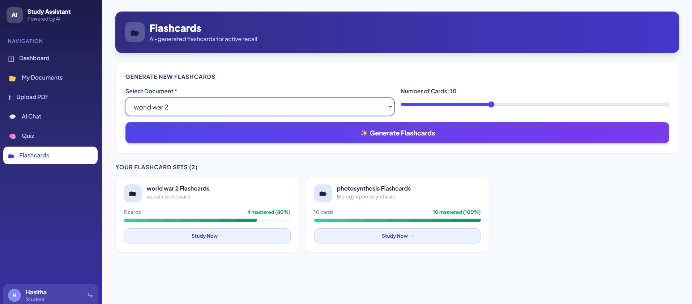
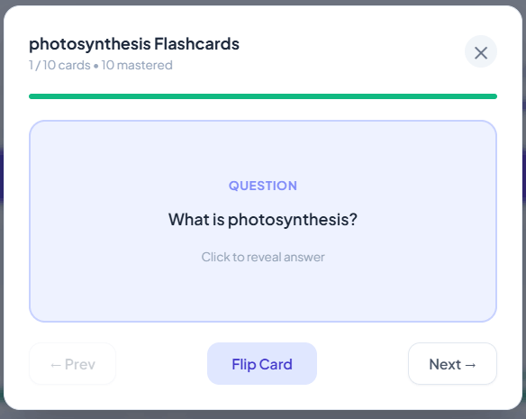
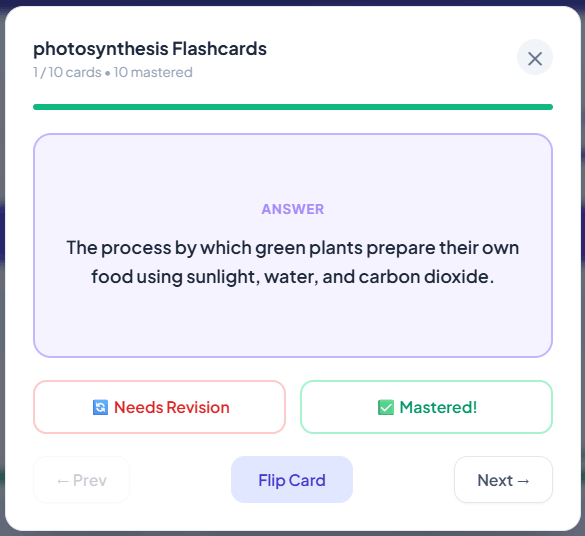
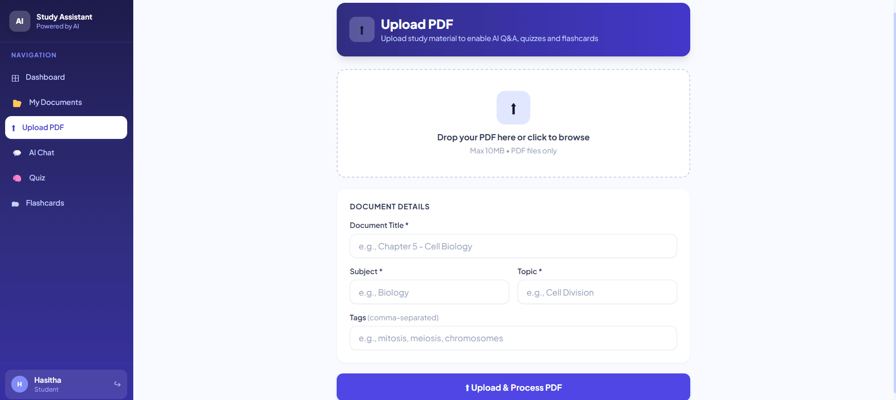

<div align="center">


# 🎓 AI Study Assistant

### _Your intelligent learning companion — powered by Groq & LLaMA 3_

[](https://reactjs.org/)
[](https://nodejs.org/)
[](https://mongodb.com/)
[](https://expressjs.com/)
[](https://tailwindcss.com/)
[](https://groq.com/)
[](LICENSE)

<br/>

> Upload your PDFs. Ask questions. Generate quizzes. Master flashcards.  
> Let AI find your weak spots before your exam does.

<br/>

[Features](#-features) • [Demo](#-screenshots) • [Quick Start](#-quick-start) • [API Docs](#-api-reference) • [Tech Stack](#-tech-stack)

</div>

---

## ✨ Features

### 🤖 AI-Powered Learning

| Feature             | Description                                                                    |
| ------------------- | ------------------------------------------------------------------------------ |
| **AI Chat Q&A**     | Ask any question about your uploaded PDFs — get instant, context-aware answers |
| **Explain Simpler** | One-click re-explanation in beginner-friendly language                         |
| **Give Example**    | AI illustrates concepts with real-world examples                               |
| **Smart Chunking**  | PDFs are split into overlapping chunks for precise context retrieval           |

### 📊 Study Tools

| Feature                  | Description                                                      |
| ------------------------ | ---------------------------------------------------------------- |
| **Quiz Generator**       | Auto-generates MCQs at Easy / Medium / Hard / Mixed difficulty   |
| **Flashcards**           | AI creates front/back cards; track Mastered vs Needs Revision    |
| **Weak Topic Detection** | Automatically flags topics where your quiz scores fall below 60% |
| **Progress Dashboard**   | Score trend charts, subject distribution, streak tracking        |

### 🔐 Authentication & Roles

| Feature          | Description                                             |
| ---------------- | ------------------------------------------------------- |
| **JWT Auth**     | Secure login with 7-day token expiry                    |
| **Student Role** | Upload PDFs, chat, quiz, flashcards, personal dashboard |
| **Admin Role**   | Platform-wide analytics, manage all users and documents |

---

## 📸 Screenshots

### Student Dashboard



### AI Chat — Ask questions from your PDF



### Quiz Generator



### Quiz Results with Explanations


### Flashcard Study Mode



### Flashcard Question



### Flashcard Answer



### PDF Upload



### Admin Dashboard


## 🗂 Project Structure

```
ai-study-assistant/
│
├── 📁 backend/
│   ├── config/
│   │   └── db.js                   # MongoDB connection
│   ├── controllers/
│   │   ├── authController.js       # Register, login, profile
│   │   ├── documentController.js   # PDF upload & management
│   │   ├── chatController.js       # AI Q&A with context retrieval
│   │   ├── quizController.js       # Quiz generation & scoring
│   │   ├── flashcardController.js  # Flashcard sets & mastery
│   │   └── analyticsController.js  # Dashboard statistics
│   ├── middleware/
│   │   ├── authMiddleware.js       # JWT protect + adminOnly
│   │   ├── errorMiddleware.js      # Global error handler
│   │   └── uploadMiddleware.js     # Multer PDF validation
│   ├── models/
│   │   ├── User.js                 # User schema + bcrypt + stats
│   │   ├── Document.js             # PDF metadata + chunks
│   │   ├── Quiz.js                 # Questions + scoring
│   │   ├── Flashcard.js            # Cards + mastery tracking
│   │   └── ChatHistory.js          # Q&A session history
│   ├── routes/                     # Express route definitions
│   ├── services/
│   │   ├── aiService.js            # Groq LLaMA 3 integration
│   │   └── pdfService.js           # PDF parsing + chunking
│   ├── utils/
│   │   └── jwtUtils.js             # Token generation
│   └── server.js                   # Express entry point
│
└── 📁 frontend/
    ├── public/
    └── src/
        ├── components/
        │   └── layout/Layout.jsx   # Sidebar + mobile nav
        ├── context/
        │   └── AuthContext.jsx     # Global auth state
        ├── pages/
        │   ├── Login.jsx
        │   ├── Signup.jsx
        │   ├── Dashboard.jsx       # Charts, stats, weak topics
        │   ├── Upload.jsx          # Drag & drop PDF upload
        │   ├── Documents.jsx       # Document library + search
        │   ├── AIChat.jsx          # Context-aware Q&A chat
        │   ├── Quiz.jsx            # MCQ quiz + results
        │   ├── Flashcards.jsx      # Study cards + mastery
        │   ├── AdminDashboard.jsx  # Platform analytics
        │   ├── AdminUsers.jsx      # User management
        │   └── AdminDocuments.jsx  # All documents view
        ├── services/
        │   └── api.js              # Axios instance
        └── App.jsx                 # Routes + guards
```

---

## 🚀 Quick Start

### Prerequisites

Make sure you have these installed:

| Tool         | Version | Download                                                      |
| ------------ | ------- | ------------------------------------------------------------- |
| Node.js      | v18+    | [nodejs.org](https://nodejs.org)                              |
| MongoDB      | v6+     | [mongodb.com](https://www.mongodb.com/try/download/community) |
| Groq API Key | Free    | [console.groq.com](https://console.groq.com)                  |

---

### Step 1 — Clone the Repository

```bash
git clone https://github.com/Hasitha-Voruganti/ai-study-assistant.git
cd ai-study-assistant
```

---

### Step 2 — Get Your Groq API Key (Free)

1. Go to **[console.groq.com](https://console.groq.com)**
2. Sign up / Log in
3. Navigate to **API Keys** → **Create API Key**
4. Copy the key — it starts with `gsk_...`

---

### Step 3 — Backend Setup

```bash
cd backend
npm install
cp .env.example .env
```

Open `.env` and fill in your values:

```env
PORT=5000
MONGO_URI=mongodb://localhost:27017/ai-study-assistant
JWT_SECRET=your_super_long_random_secret_key_here
JWT_EXPIRE=7d
GROQ_API_KEY=gsk_your_key_here
NODE_ENV=development
MAX_FILE_SIZE=10485760
```

Start the backend:

```bash
npm run dev
```

✅ You should see:

```
Server running on port 5000
MongoDB Connected: localhost
```

---

### Step 4 — Frontend Setup

Open a **new terminal**:

```bash
cd frontend
npm install
npm start
```

✅ The app opens at **[http://localhost:3000](http://localhost:3000)**

---

### Step 5 — Start Using the App

1. **Sign up** as a Student or Admin
2. **Upload a PDF** — any study material, notes, textbook chapter
3. **AI Chat** — ask questions, get instant answers
4. **Quiz** — generate MCQs and test yourself
5. **Flashcards** — create and study cards, track mastery
6. **Dashboard** — watch your progress over time

---

## 📡 API Reference

### Authentication

```
POST   /api/auth/register     Register new user
POST   /api/auth/login        Login
GET    /api/auth/me           Get current user (protected)
```

### Documents

```
POST   /api/documents/upload  Upload PDF (multipart/form-data)
GET    /api/documents         List all documents (with search)
GET    /api/documents/:id     Get single document
DELETE /api/documents/:id     Delete document
```

### AI Chat

```
POST   /api/chat              Ask a question
GET    /api/chat              Get all chat sessions
GET    /api/chat/:documentId  Get chats for a document
```

### Quiz

```
POST   /api/quiz/generate     Generate MCQ quiz from document
GET    /api/quiz              Get quiz history
GET    /api/quiz/:id          Get specific quiz
POST   /api/quiz/:id/submit   Submit answers
```

### Flashcards

```
POST   /api/flashcards/generate    Generate flashcard set
GET    /api/flashcards             Get all flashcard sets
GET    /api/flashcards/:id         Get specific set
PATCH  /api/flashcards/:id/card    Update card mastery status
```

### Analytics

```
GET    /api/analytics/dashboard    Student dashboard data
```

### Admin

```
GET    /api/admin/stats            Platform-wide statistics
GET    /api/admin/users            All users
DELETE /api/admin/users/:id        Delete user
GET    /api/admin/documents        All documents
DELETE /api/admin/documents/:id    Delete any document
```

---

## 🛠 Tech Stack

### Backend

| Technology             | Purpose                           |
| ---------------------- | --------------------------------- |
| **Node.js + Express**  | REST API server                   |
| **MongoDB + Mongoose** | Database & ODM                    |
| **Groq SDK**           | LLaMA 3.3 70B AI inference        |
| **pdf-parse**          | PDF text extraction               |
| **JWT + bcryptjs**     | Authentication & password hashing |
| **Multer**             | File upload handling              |

### Frontend

| Technology          | Purpose                  |
| ------------------- | ------------------------ |
| **React 18**        | UI framework             |
| **React Router 6**  | Client-side routing      |
| **Tailwind CSS**    | Utility-first styling    |
| **Recharts**        | Score trend & pie charts |
| **Axios**           | HTTP client              |
| **react-hot-toast** | Toast notifications      |

---

## 🧠 How the AI Works

```
PDF Upload
    ↓
Text Extraction (pdf-parse)
    ↓
Smart Chunking (800-word overlapping chunks)
    ↓
Stored in MongoDB (Document.chunks[])
    ↓
Student asks a question
    ↓
Keyword scoring → Top 4 relevant chunks selected
    ↓
Chunks + Question → Groq LLaMA 3.3 70B
    ↓
Answer returned with context snippet
```

**Why chunking?** LLMs have token limits. Instead of sending an entire 50-page PDF, we extract the most relevant 3–4 paragraphs and send those — giving precise, fast, and cost-effective answers.

---

## ⚙️ Environment Variables

| Variable        | Required | Description                               |
| --------------- | -------- | ----------------------------------------- |
| `PORT`          | No       | Backend port (default: 5000)              |
| `MONGO_URI`     | ✅       | MongoDB connection string                 |
| `JWT_SECRET`    | ✅       | Secret key for JWT signing (min 32 chars) |
| `JWT_EXPIRE`    | No       | Token expiry (default: 7d)                |
| `GROQ_API_KEY`  | ✅       | Your Groq API key                         |
| `NODE_ENV`      | No       | `development` or `production`             |
| `MAX_FILE_SIZE` | No       | Max PDF size in bytes (default: 10MB)     |

---

## 🔧 Troubleshooting

<details>
<summary><strong>MongoDB connection failed</strong></summary>

```bash
# Check if MongoDB is running
sudo systemctl status mongod

# Start if stopped
sudo systemctl start mongod

# On Mac with Homebrew
brew services start mongodb-community
```

</details>

<details>
<summary><strong>Groq API error / model decommissioned</strong></summary>

Make sure your `aiService.js` uses the current model:

```js
const MODEL = "llama-3.3-70b-versatile";
```

Check active models at [console.groq.com/docs/models](https://console.groq.com/docs/models)

</details>

<details>
<summary><strong>PDF text extraction returns empty</strong></summary>

The PDF must contain real selectable text — not a scanned image. Test by trying to select text in your PDF viewer. If you can't select text, the PDF needs OCR processing first.

</details>

<details>
<summary><strong>CORS errors in browser</strong></summary>

Ensure the backend is running on port 5000. The React app proxies `/api` requests automatically via the `"proxy"` field in `frontend/package.json`.

</details>

<details>
<summary><strong>Port already in use</strong></summary>

```bash
# Kill process on port 5000
npx kill-port 5000

# Or change the port in backend/.env
PORT=5001
```

</details>

---

## 🚢 Deployment

### Backend (Railway / Render / Heroku)

1. Set all environment variables in your hosting dashboard
2. Set `NODE_ENV=production`
3. Use **MongoDB Atlas** as your database
4. Deploy from the `/backend` folder

### Frontend (Vercel / Netlify)

1. Run `npm run build` in the `/frontend` folder
2. Deploy the `build/` directory
3. Set the API base URL to your deployed backend URL

---

## 🤝 Contributing

Contributions are welcome!

1. Fork the repository
2. Create a feature branch: `git checkout -b feature/amazing-feature`
3. Commit your changes: `git commit -m 'Add amazing feature'`
4. Push to branch: `git push origin feature/amazing-feature`
5. Open a Pull Request

---

## 📄 License

This project is licensed under the **MIT License** — see the [LICENSE](LICENSE) file for details.

---

<div align="center">

Built using React, Node.js, MongoDB & Groq AI

⭐ **Star this repo if it helped you!** ⭐

</div>
